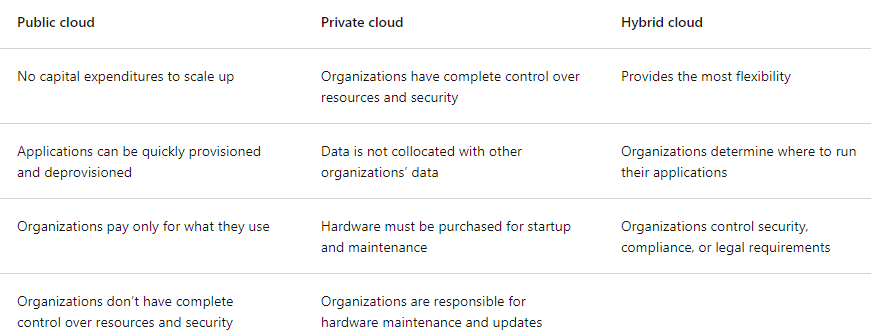

# 1.1) Intro 2 Cloud Computing

## Objectives:
  - Define: 
    - Cloud computing
    - cloud models (public, private, hybrid)
  - Describe:
    - Shared responsibility Model
    - consumption-based model
  - Compare cloud pricing models

## Cloud Computing:
    - Compute services delivery over internet
    - Compute Services:
        - Common IT Infrastructure: VMs, Storage, DBs, Networking
    - Other Cloud Services:
        - IoT, ML, AI
    - Delivered over Internet --> No Physical contraints (Load Balancing/adjustment)

## Shared Responsibility Model
    - Corp Data Center - Company Responsibilities:
        - Maintain/Replace - Physical space; Servers; IT Infrastructure; Software; Patching
        - Ensure - Security
    - Shared Resp. --> Between Cloud Providers & Consumers:
        - Provider: 
            - Physical Security, Power, Cooling, Network connectivity
        - Consumer:
            - Data Stored; Access Security
        - Many Details --> Context dependent:
            - SQL DB --> Provider: DB Maintenance; Consumer: Data ingested
            - DB inside a VM --> Consumer: Data Ingested; DB Maintenance 
    - Constant Resp.s:
        - Consumer: Data Stored in Cloud; Devices/Accounts/IDs allowed to connect
        - Provider: Physical Datacenter/Network/Host

    - Model Types:
        - IaaS (Infra as a Service):
            - Most Resp. on Consumer
            - Provider Resp.s:
                - Phys. Sec.; Power, Connectivity 
        - PaaS (Infra as a Service):
            - Resp.s similarly distributed
        - SaaS (Infra as a Service):
            - Most Resp.s on Provider

## Cloud Models
    - Private; Public; Hybrid

    - Private Cloud:
        - Evolution from On-Prem/Corp. Datacenter
        - Cloud used by 1 entity
        - Greatest Company/IT Departmental Control
        - Most Costly
        - Can be hosted: on-prem/dedicated datacenter (also 3rd part potentially)
    - Public Cloud:
        - Built; Controlled; Maintained by 3rd Party (Azure, GCP, AWS)
        - Anyone can purchase cloud services (access/use resources)
        - Key difference: General Public Availability
    - Hybrid Cloud:
        - Combine Publice/Private in inter-connected env
        - E.g. Use Cases:
            - Deploying Extra public cloud resources to Surge private cloud to handle increased & temp. demand 
            - Add extra security layer

    - Comparative table:

    - Multi Cloud:
        - Use multiple public cloud providers
            - Mix & Match features/offerings
            - Start with 1 --> Decide to migrate to another
        - Manage Resources & Security in 2+ envs
    
    - Azure Arc:
        - Cloud Env Mgmt Tech Set
        - Options: Azure-only; Private; Hybrid; Multi-cloud  
    - Azure VMware Solution:
        - Run pre-established VMware workloads in Azure seamlessly
        - VMware: Cloud com & Virtualization company for private/hybrid clound envs

## Consumption-based Model
    - IT Infra Expense Type:
        - CapEx (Buying & Owning hardware Assets/Resources --> Balance Sheet Items)
            - On-Prem
        - OpEx (Renting --> P&L Items)
            - Cloud --> Consumption-based model
    - Benefits:
        - No Upfront costs
        - No CapEx
        - Up/Down scaling as needed
        - Plan/Manage OpEx
        - Run Infrastructure More Efficiently
