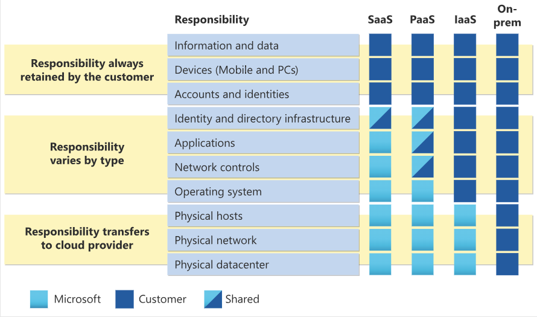

# 1.3) Cloud Service Types

## Objectives:
	- Describe: 
		- Infrastructure as a Service
		- Platform as a Service
		- Software as a Service
	- Identify:
		- Use Cases for cloud service types

## Shared Resp. Model

## Infrastructure as a Service
- Maximum Control of Cloud Resources --> Most cloud service flexibility/responsibility
- Provider Responsibilities:
	- Hardware, Network/Internet Connections, Physical Sec.
- Consumer Resp.s: All Else
	- Install/Config OS; DB; Storage; Network
- In Short:
	- Rent Hardware from cloud datacenter
	- what you do with hardware --> totally up to you

- IaaS Use Cases:
	- Lift-&-Shift Migration:
		- Move On-Prem infra to similarly setup IaaS Cloud Infra
	- Dev & Test Envs:
		- Given Configs needing quick replication/setup while maintaining total control

## Platform as a Service
- In-Between IaaS & SaaS
- Provider Resp.s:
	- Like IaaS: Phys. Infra, Sec., Connection
	- Extra: Maintain OS, Middleware, Dev Tools, BI Services
		- No licensing/patching/OS/DB worries
- Suitable for: 
	- Provide complete Dev Env
	- Without Dev Infra Maintenance headache

- PaaS Use Cases:
	- Dev Framework:
		- Framework Devs can extend to further develop/customize cloud-based apps - ~Excel Macro's
		- Reduce Amount of coding needed
	- BI/Analytics:
		- enable data mining

## Software as a Service
- Rent Complete & Deployed Solution/Developed Application
- Least Flexible; Fastest to Setup; Least Technical

- Consumer Resp.s:
	- Data Ingested; Connected Devices; User Access

- E.g. Use Cases (Apps): 
	- Email
	- Financial Software
	- Messaging/Productivity Apps
	- Connectivity Software
