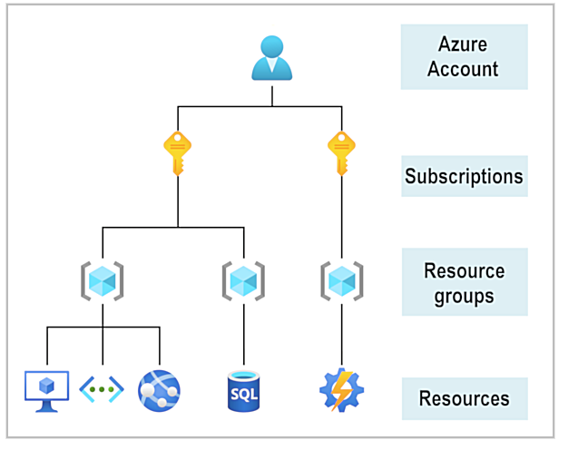
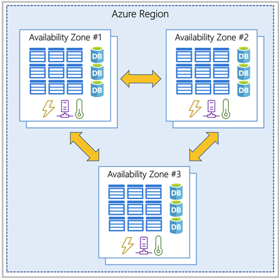
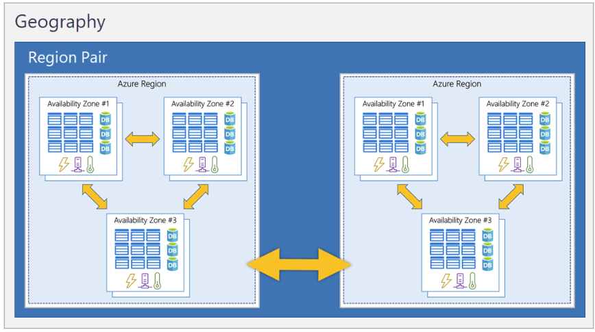
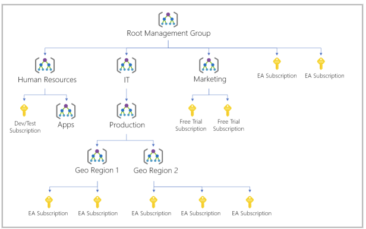

# 2.1) Azure Core Architectural Components

## 2.1.1) Intro
## Objectives:
	- Describe: 
        - Azure: 
            - Regions, Region Pairs, Sovereign Regions
            - Availability Zones
            - Datacenters
            - Resources; Resource Groups
        - Subscriptions
        - Mgmt Groups
        - Hierarchy for Resource Groups, Subcriptions, Mgmt Groups

 

## 2.1.2) Microsoft Azure
- Expending Cloud Services - help to meet business needs
- Offers:
    - Freedom to:
        - Build; Manage; Deploy Apps 
        - on Global/Massive scale
        - Using Favorite Tools/Frameworks

### Azure Offering
- Future Proof
    - Continuous Innovation for Azure:
        - Support Dev. today + Future Visions
- Building on own Terms:
    - Many Options/Choices + Commitment 2 Open Source
        - Support for most Languages/Frameworks
        - Build How/Deploy Where you want to
- Seamlessly Hybrid
    - On-prem/Cloud-native/in-between

- Trust in Cloud:
    - Ground up security
    - Backed by expert teams
    - Proactive compliance 
    - Trusted by Enterprises/Governments/Startups

### What can I do with Azure
- 100+ services/offers:
    - e.g.:
        - run existing apps on VMs
        - Explore new software paradigms - intelligent bots; mixed reality
        - AI/ML services
            - also Vision/Hearing/Speech
        - Storage Solutions

- Common start:
    - Move existing app to VM - run in Azure
        - Good start - Cloud offers much more

## 2.1.3) Get started with Azure Accounts

- 

- [Azure Portal Home Page](https://portal.azure.com/#home)

### Microsoft Learn Sandbox
- Temp Sandbox Env. to complete LP exercises
- Creates Temp Subscriptions
    - added to your Azure accounts
    - allows resource creation during Learn Modules
    - automatically cleans up temp resources after acompleting the module

- FYI:
    - can use Personal Subscription for exercies
    - Sandbox is preferred:
        - Create/Test azure resources for free!!!
    
## 2.1.4) Explore Learn Sandbox

- 1) Use ***Powershell CLI***
    - Current Date: `Get-date`
    - Azure specific Commands:
        - Uses ***Azure CLI***: `az ...`
            - version test: `az version`

- 2) Use ***Bash CLI***
    - Switch to bash from Powershell CLI: `bash`
    - Current Date: `date`
    - Run Azure CLI commands: `az ...`
        - e.g. Upgrade Azure CLI: `az upgrade`
    - return to Powershell Mode: `pwsh`

- 3) Use Azure CLI Interactive Mode
    - Enter Interactive Mode: `az interactive`
        - this is Azure specific - no need for `az ` preposition
            - Version check: `version`
            - Upgrade: `upgrade`
            - Exit: `exit`

- 4) Use the Azure Portal
    - Option will show/pop-up for sandbox exercises
        - Use provided link
            - Keeps exercises free for user

## 2.1.5) Azure Physical Infrastructure
- Important Terms: Regions; Availability Zones; Resources; Subscriptions, etc.
- 2 Core architectural Component Groups:
    - Physical Infrastructure
    - Mgmt Infrastructure

### Physical Infrastructure
- Start: DataCenter
    - Same as Large Corporate Datacenter
    - Facilities with Racks of Resources; Dedicated Power, Cooling; Networking Infra

- Azure: Datacenters around the globe
    - Inaccessible Directly
    - Grouped into: 
        - Azure Regions 
        - Availability Zones
    - Designed for Resilience/Reliability

### Regions
- Def: Geopraphical Area containing at least 1 datacenter that is nearby and networked together with low-latency network
    - TLDR:
        - Geographical Area
        - Contains 1/more datacenter
        - Is close by
        - Is connected with low-latency network
    - Azure:
        - Intelligent Resource Control/Assignment within Region
            - Ensure well-balanced workloads

- Upon Resource Deployment: Choosing regoin to be deployed on 
- +1s: 
    - Some Services/VM features - Region-specific Availability
    - Services without Region Selection:
        - Azure Active Directory
        - Azure Traffic Manager
        - Azure DNS

### Availability Zones
- Def: Physically separate datacenters within Azure Regions
    - Made up of 1+ datacenters with:
        - Independent Power; Cooling; Networking
- Set up to an Isolation Boundary
    - i.e. If/When 1 Zone goes down; other continues working
- Availability Zones:
    - Connected through high-speed, private fiber-optic networks:
    - Resilience Insurance:
        - 3+ Availability Zones per Region
            - Availability Zone Enabled Regions
    - Not all Azure Regions support Availability Zones

- 

- Usage in your Apps
    - Ensure Service/Data Redundancy:
        - Fail-Proof/Protect information
    - Own Infrastructure hosting setup:
        -  Create duplicate hardware environments --> Availability Zones
    - Co-Locate Compute; Storage; Network; Data Resources in Availability Zone
        - Then Replicate then in another
        - Cost associated with resource duplication
    - Primary Purpose: 
        - VMs; Managed Disks; Load Balancers; SQL DBs
        - 3 Categories:
            - Zonal Services:
                - Pin Resource to Specific Zone
            - Zone-Redundant Services:
                - Platform Replicated Automatically Across Zone
                    - e.g. Zone-Redundant Storage; SQL DBs
            - Non-Regional Services:
                - Always available from Azure Geopraphies
                - Resilient to Zone/Region-Wide Outages

    - Additional Resiliency --> Region Pairs

### Region Pairs

- Affected Region --> services fall over to respective Region Pair
- Regions paired: 
    - in same Geography (US, EU, Asia)
    - Min. 500 km distance
    - Reduce interruption likelihood affecting entire regions caused by:
        - Natural Disasters
        - Civil Unrest
        - Power/Physical Network Outage
- Not automatic for every service

- E.g.s:
    - West US - East US
    - Sotuh-East Asia - East Asia
    

- Other Benefits:
    - Large Outages: 
        - 1 region in Region Pair is prioratized to recover ASAP
    - Planned Updates:
        - rolled out 1 region at a time within Region Pairs
    - Data located in same Region

- +1s:
    - ***Most*** Region Pairs are eachothers' backups
        - exc. e.g. West India - Brazil South --> 1 directional pairing
            - Primary Region is not backup for Secondary Region

### Sovereign Regions

- Azure Instances ***Fully Isolated*** from main Azure Instance
- Possibly needed for Compliance/Legal reasons
- e.g.s: 
    - Physical/Logical Network isolated Azure instances:
        - US Department of Defense Central
        - US Government Virginia; Iowa
    - 21Vianet - Microsoft partnership - Vianet maintains datacenters:
        - China East
        - China North

## 2.1.6) Azure Mgmt Infrastructure

- Includes Azure:
    - Hierarchical Org.: Resources; Resource Grps; Subscriptions; Accounts

### Resources & Resource Grps

- Basic Azure Building Block: ***Resource***
    - E.g: VMs; V(P)Ns; DBs; Cognitive Services 
    - Resource Creation --> Must place inside ***Resource Group***
    - Only in 1 Resource Grp at a time
        - Some - can move betw. Resource Grps
            - Assoc. w 1 Resource Grp at a time

- Resource Groups --> Grouping of Resources
    - Cannot be nested
    - Applying Actions - e.g. Security Config 
        - at Resource Grp. level
        - all resourcees within Resource Grp affected
            - e.g. Resource Grp deletion:
                - All resources within are deleted
    
    - Resource Provisioning task: design suitable Resource Grp structure
        - e.g: 
            - Temp. dev env> 1 Resource Grp -->  delete Resource Grp when done
            - 3 access schemas: 3 Resource Grp by access schema --> access config by Resource Grp

### Subscriptions

- Unit of Mgmt, Billing, Scale
- Logically organize Resource Grps
    - Sub. > Resource Grp > Resource
- Facilitate Billing
- Linked to Azure Account - i.e. Azure AD Identity
    - 1 Account --> Single/Multiple subscriptions
        - Multi-Sub: 
            - Config different Billing Models; AM Policies
            - Define Boundaries Betw Prods/Services/Resources
                - Boundary Types:
                    - Billing boundary: separate billing reports
                    - Access Ctrl Boundary: e.g. subs per department

- Gives Authenticated & Authorized access for Prods/Services
    - Allows resource provisioning

- Adding subscriptions - to Separate:
    - Env.s: Dev; Test; Secu; Data Isolation - Resource Access Ctrl @ Subs. Level
    - Org. Structures: Limit Mkt.ing to Low-cost resources; IT to full-range
    - Billing: Billing is 1st aggregated to Subs. level --> costs overview of Env.s & Org.s

### Mgmt Groups

- Resource > Res. Grp. > Subs.

- Many Apps; Dev. Teams; Geographies --> Many Subs
- Mgmt Grps --> Efficient Subs. Mgmt
    - Organize Subs into Containers i.e. Mgmt Grps
    - Cond. Inheritance fr Mgmt Grps --> applied to all Subs in Mgmt Grp
    - Can Nest upto 6 intermediate levels

- E.g. structures:
    - Policy Applying Hierarchy:
        - Production Grp: Limit VM locations to US West Region
            - Policy Inheritance to all descendants - Mgmt Grps; Subs
            - Cannot be changed by descendants
    - User Access provision to many Subs:
        - 1 Rule-based Access Ctrl (RBAC) assignment to Mgmt Grp
            - Polciy Inheritance: All Sub-Mgmt Grps; Subs; Res. Grps; Resources

- +1s:
    - 1 directory - 10k Mgmt Grps
    - Mgmt Grp tree - 6 intermediate levels depth (exc. Root & Subs Levels; )
    - Only 1 Parent - Mgmt Grps/ Subs

## 2.1.7) Create Azure Resource
