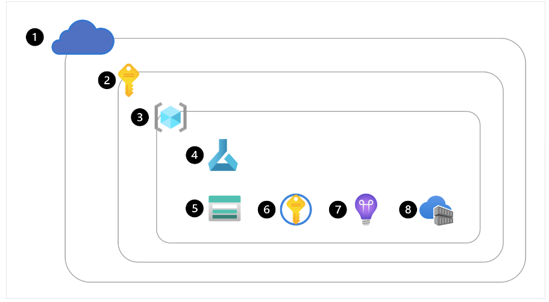

# 1.1) Explore Azure ML

## Objectives:
    - Create Azure ML workspace
    - Identify Resources & Assets
    - Train Models in workspace


## Create Azure ML Workspace:
    - 0) Get Azure Access (#1) + Subscription (#2) - via Azure Portal 
    - 1) Create Resource Group (#3)
    - 2) Create Azure ML service to create workspace (#4)
        - Once Workspace Provisioned --> AZ creates resources to support workspace: 
            - (#5) Storage Account: workspace File/Notebook/Job/Model/Metadata storage 
            - (#6) Key Vault: Secure Secrets mgmt - workspace auth keys, credentials
            - (#7) Application Insights: Predictive services monitoring
            - (#8) Container Registry: store Azure ML envs




### Creating the Workspace
- via Azure Portal
- Azure Resource Manager (ARM) template - [Learn How](https://learn.microsoft.com/en-us/azure/machine-learning/how-to-create-workspace-template?view=azureml-api-2&tabs=azcli)
- Azure CLI with Azure ML CLI extension - [Learn How](https://learn.microsoft.com/en-us/training/modules/create-azure-machine-learning-resources-cli-v2/)
- Azure ML Python SDK - see e.g. python script below

```
from azure.ai.ml.entities import Workspace

workspace_name = "mlw-example"

ws_basic = Workspace(
    name=workspace_name,
    location="eastus",
    display_name="Basic workspace-example",
    description="This example shows how to create a basic workspace",
)
ml_client.workspaces.begin_create(ws_basic)
```

### Explore WS
    - Launch: Overview tab > Studio web URL
        - Azure ML Studio: web portal UI - create/manage/use resources/assets
    - IAM: Access control
        - Role-based Access Ctrl
            - restrict actions to users/teams - e.g. 
                - admins create compute targets/datastores
                - data scientists create/run jobs for model training/registration
            - 3 general pre-built role groups:
                - Owner: full access to all + grant access to others
                - Contributor: full acces to all + no access granting
                - Reader: view all + not making any changes
            - 2 Azure ML built-in roles:
                - Azure ML Data Scientist: 
                    - perform all actions in workspace except 
                    - no resource creation/deletion
                    - no workspace edits
                - Azure ML Compute Operator:
                    - create/change/manage access for resources
    - Organization
        - Large-scale projects --> 2+ Workspaces
        - Use WSs to group ML assets - by projects; deployment envs (dev/stage/prod); teams 
    


## ID Azure ML Resources
    - Resources: 
        - Infra needed to run ML workflows:
            - Workspace
            - Compute Resources
            - Datastores
        - Ideally Admins should create/manage resources

### Create & Manage WS
    - Workspace: top-level resource for Azure ML
        - +1: No data stored
    - DSs need WS access - for model training/tracking/deployment to endpoints
    - Careful who has *full access* - available entities
        - Compute Resource; Datastore references
        - Logs
        - Metrics
        - Outputs
        - Models
        - Code Snapshots

### Create & Manage Compute Resources
- 5 Compute types in Az ML WS:
    - *Compute Instances*: 
        - ~VM managed by WS 
        - Use as Dev Env to run Notebooks
    - *Compute Clusters*: 
        - On-demand cluster of cloud CPU/GPU nodes managed by WS.
        - Use for prod workloads (autoscaling)
    - *Kubernetes Clusters*: 
        - Allows attaching *Azure Kubernetes Service* cluster
        - use for trained ML model prod deployment
    - *Attached Compute*: 
        - Allows attaching compute resources to WS
        - e.g. Az Databricks; Synapse Spark pools
    - *Serverless Compute*:
        - fully managed, on-demand compute
        - use for training jobs
        - Az ML creates/manages it for you - no option to see in Az ML Studio
- Most cost-intensive:
    - only allow admins for creation/mgmt
    - DSs: only use available Compute to run workloads

### Create & Manage Datastores
- Data not stored in WS --> Datastores
    - references to Azure Data Services
        - Connection Info to a Data Service
            - stored in Azure Key Vault
- WS created --> Stored account created + connected to WS
    - 4 datastores added to WS (default):
        - *workspaceartifactstore*: 
            - connects to *azureml* container in AZ Storage account
            - stores compute/experiment log for running jobs
        - *workspaceworkingdirectory*: 
            - connects to AZ Storage accounts' file share
            - uploaded folders/files stored in here - for access via compute instance
        - *workspaceblobstore*: 
            - connects to blob storage: `azureml-blobstore-...` container
            - default datastore - new data asset created / data uploaded --> stored here
        - *workspacefilestore*: 
            - connects to Storage accounts' fileshare: `azureml-filestore-...` file share
    - +1: 
        - can create datastores to connect to other AZ data services
            - Most common (in DS projects):
                - Azure Storage Account
                - Azure Data Lake Storage (Gen2)


## ID Azure ML Assets
- bla

## Train Models 
- bla

## Exercise - Explore Workspace
- bla

## Knowledge Check
- bla
